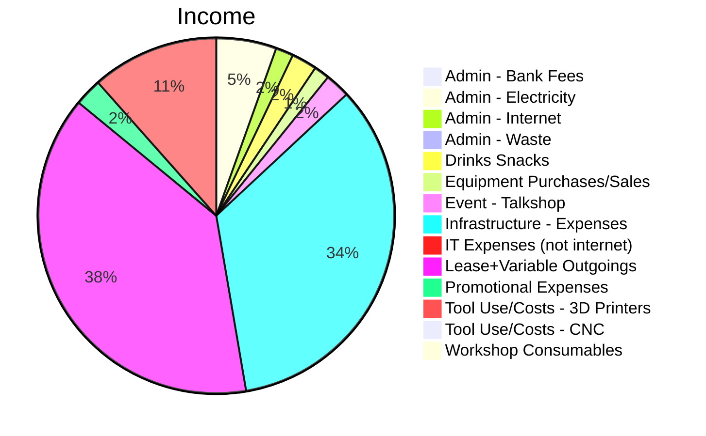

# Header

```mermaid
pie title Income
    "Admin - Bank Fees" :	35.89
    "Admin - Electricity" :	694.86
    "Admin - Internet" : 205.00
    "Admin - Waste" : 91.85
    "Drinks Snacks" : 293.56
    "Equipment Purchases/Sales" : 179.00
    "Event - Talkshop" : 288.19
    "Infrastructure - Expenses" :	4361.08
    "IT Expenses (not internet)" : 0.00
    "Lease+Variable Outgoings" : 4918.84
    "Promotional Expenses" : 317.67
    "Tool Use/Costs - 3D Printers" : 1468.14
    "Tool Use/Costs - CNC" : 18.53
    "Workshop Consumables" : 30.80
```

